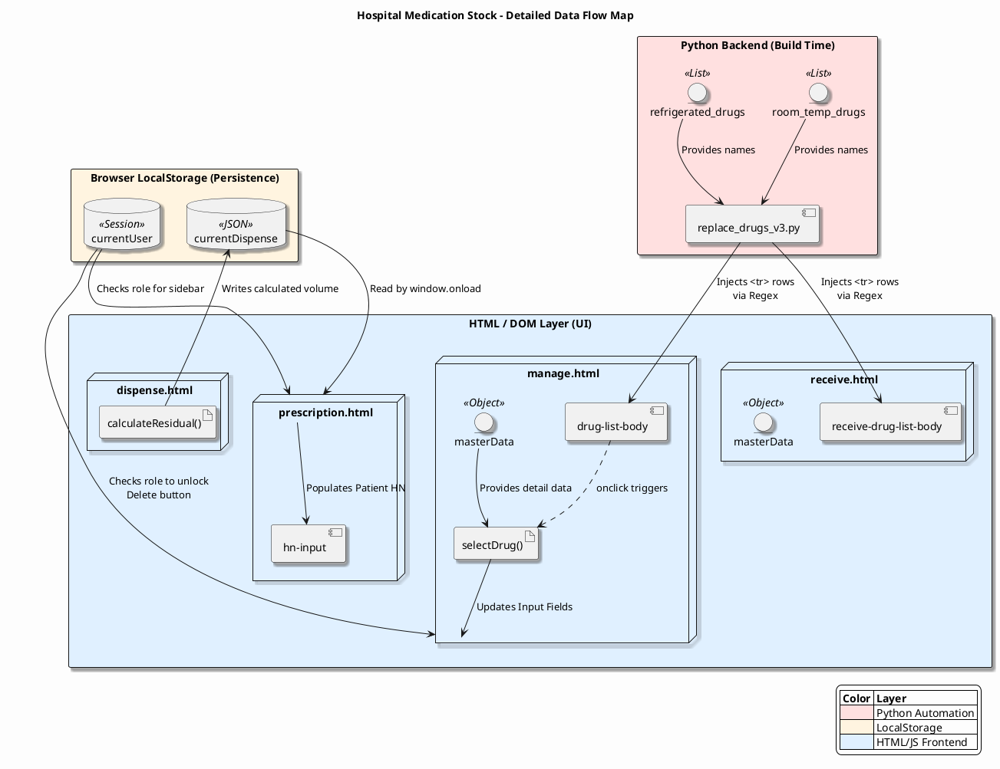

# แผนผังความสัมพันธ์ของตัวแปร (PlantUML Data Flow Diagram)

เอกสารฉบับนี้แสดงโค้ด PlantUML ที่จำลองการเชื่อมโยงของตัวแปรในระบบตามรายงานการวิเคราะห์การไหลของข้อมูล

---

## 1. PlantUML Code

คุณสามารถนำโค้ดด้านล่างนี้ไปวางใน [PlantText](https://www.planttext.com/) หรือ [PlantUML Online Server](https://www.plantuml.com/plantuml/) เพื่อดูภาพกราฟิกได้ครับ

---

## 2. คำอธิบายความสัมพันธ์ในไดอะแกรม

1.  **Python Layer (สีชมพู):** เป็นต้นทางของข้อมูลยา (Lists) ที่จะถูกสคริปต์ `replace_drugs_v3.py` นำไป "ฉีด" ลงใน DOM Elements ของไฟล์ HTML โดยตรง
2.  **HTML/DOM Layer (สีฟ้า):** 
    *   `masterData` ทำหน้าที่เป็นฐานข้อมูลจำลองภายในหน้าเว็บ
    *   `selectDrug()` คือตัวกลางที่คอยดึงข้อมูลจาก `masterData` มาแสดงบนหน้าจอเมื่อ User คลิกเลือกยา
    *   `calculateResidual()` คือตรรกะการคำนวณเคมีบำบัดหลัก
3.  **LocalStorage (สีส้ม):** เป็นสะพานเชื่อมระหว่างหน้าเว็บ
    *   `currentDispense` รับข้อมูลผลลัพธ์การคำนวณจากหน้าเบิกยา และส่งต่อให้หน้าพิมพ์ฉลาก
    *   `currentUser` เก็บสิทธิ์ของผู้ใช้เพื่อเปิด/ปิดฟังก์ชันตาม Role

---
*จัดทำแผนผัง PlantUML เรียบร้อย พร้อมรับคำสั่งพัฒนาต่อครับ*
