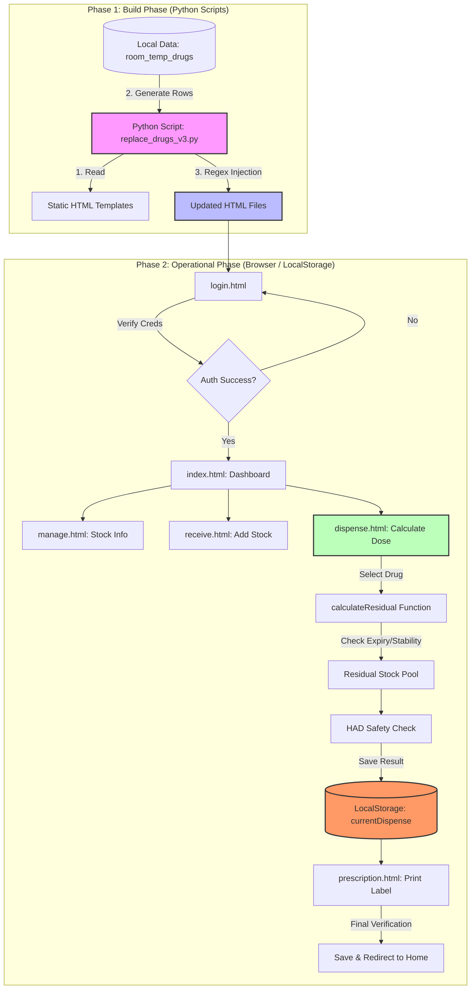

# แผนผังการทำงานของระบบ (System Flowchart)

เอกสารฉบับนี้แสดงขั้นตอนการทำงานของระบบจัดการสต็อกยาโรงพยาบาล แบ่งออกเป็น 2 ช่วงหลัก คือ ช่วงการเตรียมข้อมูล (Build Phase) และช่วงการใช้งานจริงโดยผู้ใช้ (Operational Phase)

---

## 1. ผังภาพรวมการทำงาน (Mermaid Flowchart)

---

## 2. อธิบายขั้นตอนการทำงานอย่างละเอียด

### 2.1 ช่วงการเตรียมข้อมูล (Build Phase)
เป็นหน้าที่ของนักพัฒนาหรือแอดมินในการรันสคริปต์ Python เพื่ออัปเดตข้อมูลเบื้องต้น:
1.  **Input:** สคริปต์ Python เช่น `replace_drugs_v3.py` จะเตรียมรายชื่อยาไว้ในตัวแปร
2.  **Processing:** สคริปต์จะอ่านไฟล์ HTML และใช้ **Regex** ค้นหาจุดที่จะฉีดโค้ด (เช่น `<tbody>`)
3.  **Output:** ไฟล์ HTML จะถูกอัปเดตข้อมูลตารางยาและ JavaScript Logic พร้อมสำหรับการใช้งานบน Browser

### 2.2 ช่วงการใช้งานโดยผู้ใช้ (Operational Phase)
เมื่อผู้ใช้งาน (เภสัชกร) เปิดระบบผ่าน Browser:

1.  **การยืนยันตัวตน (Authentication):**
    *   ผู้ใช้ล็อกอินที่ `login.html` ระบบจะตรวจสอบข้อมูลใน `chemo_users` (LocalStorage)
    *   หากสำเร็จ จะสร้าง Session ชื่อ `currentUser` และอนุญาตให้เข้าสู่หน้า Dashboard

2.  **การจัดการคลังยา (Inventory Management):**
    *   ผู้ใช้สามารถดูข้อมูลยาผ่าน `manage.html` ซึ่งจะดึงข้อมูลจาก `masterData` มาแสดง
    *   หากต้องการรับยาเข้าคลัง จะไปที่ `receive.html` เพื่อสแกนบาร์โค้ดและบันทึกล็อตยา

3.  **ขั้นตอนการคำนวณและเบิกยา (Dispensing Workflow):**
    *   **ที่หน้า `dispense.html`:** ผู้ใช้เลือกผู้ป่วยและรายการยาที่แพทย์สั่ง
    *   **Logic:** ฟังก์ชัน `calculateResidual()` จะคำนวณว่าต้องใช้ยากี่ขวด และมียาที่เปิดค้างไว้ (Residual) มาใช้ร่วมด้วยได้หรือไม่
    *   **Safety:** หากเป็นยาอันตราย (HAD) ต้องผ่านขั้นตอน `HAD Safety Check` ก่อน

4.  **การส่งต่อข้อมูลและการพิมพ์ฉลาก (Data Passing & Output):**
    *   เมื่อคำนวณเสร็จ ข้อมูลผลลัพธ์จะถูกเขียนลงใน **`LocalStorage: currentDispense`**
    *   ระบบจะ Redirect ผู้ใช้ไปที่ `prescription.html` โดยอัตโนมัติ
    *   หน้าจ่ายยาจะอ่านข้อมูลจาก LocalStorage มาแสดงผลเพื่อพิมพ์ฉลากยาและบันทึกปิดเคส

---
*จัดทำแผนผังการทำงานเรียบร้อย พร้อมรับคำสั่งพัฒนาต่อตามแผนที่วางไว้ครับ*
