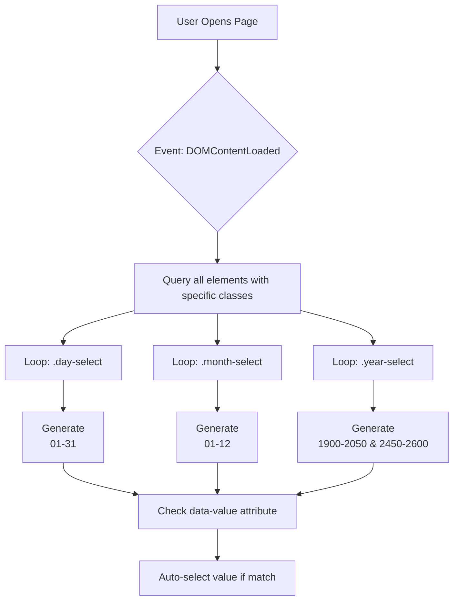
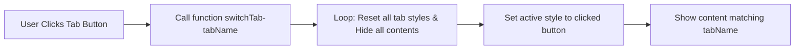
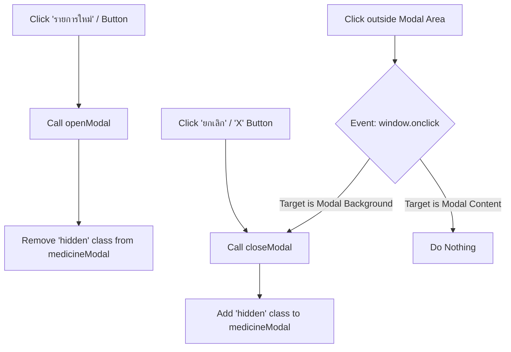
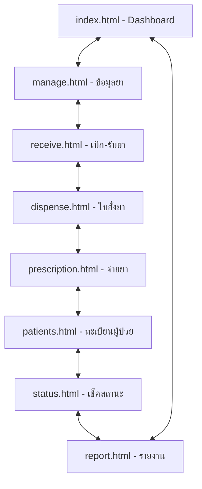

# System Technical Flowchart

แผนภาพนี้แสดงความสัมพันธ์และการทำงานของฟังก์ชัน (JavaScript) และกระบวนการเข้าถึงข้อมูล (UI Logic) ในระบบปัจจุบัน

---

## 1. การทำงานเมื่อโหลดหน้าจอ (Initialization Flow)
ใช้ในหน้า: `manage.html`, `dispense.html`

---

## 2. การจัดการข้อมูลยา (Medicine Management Flow)
ใช้ในหน้า: `manage.html`

### 2.1 ระบบแท็บ (Tab Navigation)

### 2.2 ระบบหน้าต่างป๊อปอัพ (Modal Logic)

---

## 3. ผังความสัมพันธ์ของหน้าจอ (Navigation Flow)
แสดงการเชื่อมโยงระหว่างไฟล์ผ่าน Sidebar และ Header Tabs

---

## สรุปรายละเอียดทางเทคนิค
1.  **Event Handling:** ใช้ `addEventListener` สำหรับการเริ่มต้นหน้าจอ และ `onclick` สำหรับการตอบสนองทันที
2.  **DOM Manipulation:** เน้นการเปลี่ยนสถานะ Class (`hidden`) และการเปลี่ยน `className` ของ Element เพื่อเปลี่ยนรูปแบบการแสดงผล (CSS-driven UI)
3.  **Data Injection:** ใช้ `insertAdjacentHTML` เพื่อลดภาระการเขียน HTML ซ้ำซ้อนในส่วนของวันที่และเวลา
4.  **Scope:** ฟังก์ชันทั้งหมดยังเป็น Global Scope อยู่ภายในแต่ละไฟล์ (In-file scripts)
