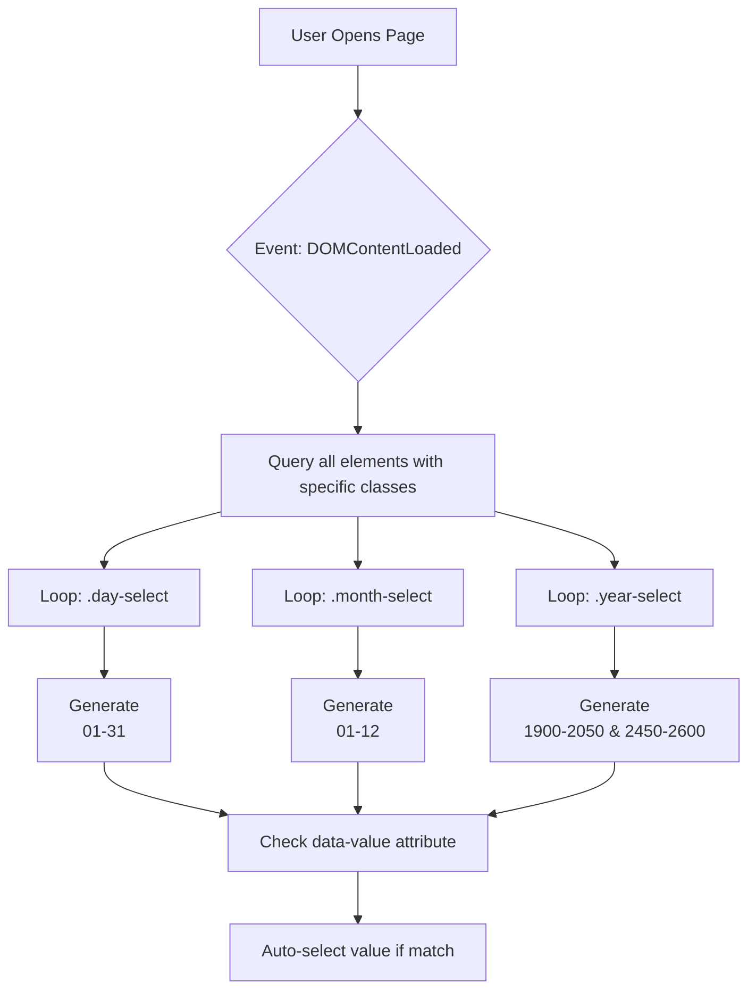
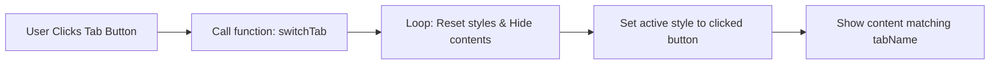
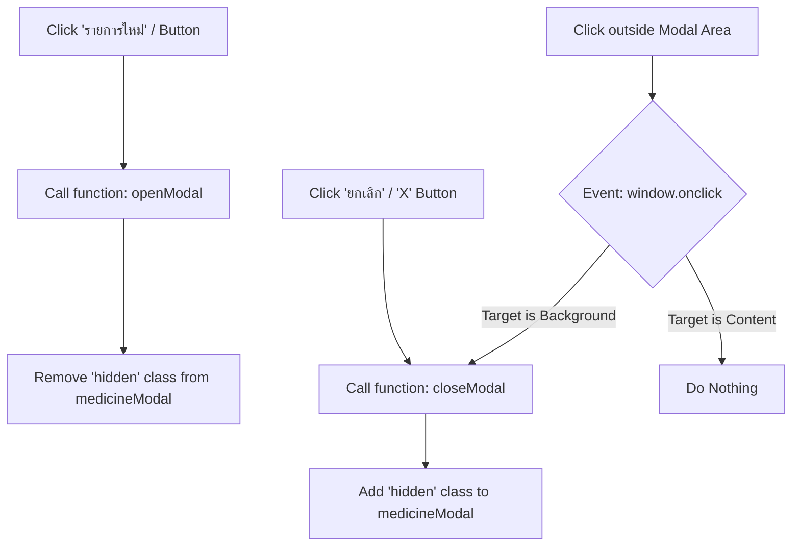
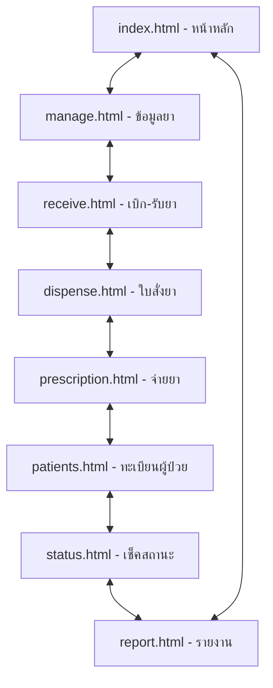

# System Technical Flowchart

แผนภาพนี้แสดงความสัมพันธ์และการทำงานของฟังก์ชัน (JavaScript) และกระบวนการเข้าถึงข้อมูล (UI Logic) ในระบบปัจจุบัน

---

## 1. การทำงานเมื่อโหลดหน้าจอ (Initialization Flow)
ใช้ในหน้า: `manage.html`, `dispense.html`

### คำอธิบาย Node (Node Definitions):
*   **Start**: ผู้ใช้งานเข้าถึงหน้าเว็บผ่าน Browser
*   **InitEvent**: เหตุการณ์ที่ Browser โหลดโครงสร้าง HTML เสร็จสมบูรณ์ (DOM Ready)
*   **QuerySelectors**: ใช้ `document.querySelectorAll` ค้นหา Dropdown ที่ต้องการเติมข้อมูลอัตโนมัติ
*   **LoopDays / LoopMonths / LoopYears**: การวนลูปเพื่อจัดการ Element ในแต่ละประเภท (วัน, เดือน, ปี)
*   **GenDays / GenMonths / GenYears**: การใช้ `insertAdjacentHTML` เพื่อสร้างรายการตัวเลือก (`<option>`) ลงใน Dropdown
*   **CheckDataValue**: ตรวจสอบคุณสมบัติ `data-value` ที่ระบุไว้ใน HTML (เช่น `data-value="06"`)
*   **AutoSelect**: คำสั่งกำหนดค่า `select.value` ให้ตรงกับ `data-value` เพื่อแสดงผลค่าเริ่มต้นจากฐานข้อมูล

---

## 2. การจัดการข้อมูลยา (Medicine Management Flow)
ใช้ในหน้า: `manage.html`

### 2.1 ระบบแท็บ (Tab Navigation)

### คำอธิบาย Node (Node Definitions):
*   **TabClick**: ผู้ใช้คลิกเลือกแท็บข้อมูล (เช่น ข้อมูลทั่วไป, รายละเอียดเพิ่มเติม)
*   **CallSwitchTab**: เรียกฟังก์ชัน `switchTab(tabName)` เพื่อเริ่มกระบวนการเปลี่ยนหน้าจอ
*   **ResetUI**: การล้างสถานะเดิม โดยซ่อน Content ทั้งหมด และเปลี่ยนสไตล์ปุ่มให้เป็นสถานะปกติ
*   **ActivateTab**: การเปลี่ยน Class ของปุ่มที่ถูกคลิกเพื่อให้แสดงสถานะว่ากำลังถูกเลือก (Active)
*   **ShowContent**: การลบ Class `hidden` ออกจาก Content ID ที่ตรงกับชื่อแท็บที่เลือก

### 2.2 ระบบหน้าต่างป๊อปอัพ (Modal Logic)

### คำอธิบาย Node (Node Definitions):
*   **OpenBtn**: คลิกปุ่มเพื่อเริ่มเพิ่มรายการยาใหม่
*   **CallOpenModal**: เรียกฟังก์ชัน `openModal()`
*   **ShowModal**: เปลี่ยนสถานะการแสดงผลของ ID `medicineModal` จากซ่อนเป็นแสดง
*   **CloseBtn**: คลิกปุ่มยกเลิกหรือปุ่มปิด
*   **CallCloseModal**: เรียกฟังก์ชัน `closeModal()`
*   **HideModal**: ใส่ Class `hidden` กลับไปที่ ID `medicineModal`
*   **OutsideClick / GlobalClick**: ระบบตรวจสอบการคลิกที่พื้นที่ว่างรอบหน้าต่างป๊อปอัพ
*   **Ignore**: หากคลิกภายในหน้าต่างป๊อปอัพ ระบบจะไม่มีการทำงานใดๆ (เพื่อป้องกันการปิดหน้าต่างโดยไม่ตั้งใจ)

---

## 3. ผังความสัมพันธ์ของหน้าจอ (Navigation Flow)
แสดงการเชื่อมโยงระหว่างไฟล์ผ่าน Sidebar และ Header Tabs

---

## สรุปรายละเอียดทางเทคนิค
1.  **Event Handling:** ใช้ `addEventListener` สำหรับการเริ่มต้นหน้าจอ และ `onclick` สำหรับการตอบสนองทันที
2.  **DOM Manipulation:** เน้นการเปลี่ยนสถานะ Class (`hidden`) และการเปลี่ยน `className` ของ Element เพื่อเปลี่ยนรูปแบบการแสดงผล (CSS-driven UI)
3.  **Data Injection:** ใช้ `insertAdjacentHTML` เพื่อลดภาระการเขียน HTML ซ้ำซ้อนในส่วนของวันที่และเวลา
4.  **Scope:** ฟังก์ชันทั้งหมดยังเป็น Global Scope อยู่ภายในแต่ละไฟล์ (In-file scripts)
